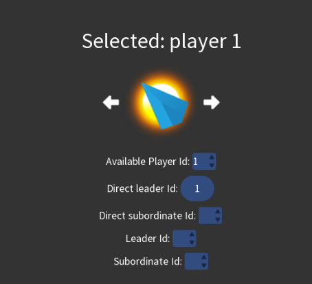

# Quick start guide

1. [Core idea](#core-idea)
2. [Create new game](#create-new-game)
3. [Game UI](#game-ui)
4. [Let AI do everything](#let-ai-do-everything)
5. [Half-manual control for beginners](#half-manual-control-for-beginners)

## Core idea

Though a computer game can never be fully realistic, a certain degree of realism makes a game more immersive and
interesting. From our current knowledge in physics, our universe is governed by Einstein's theory of relativity.
Particularly, to describe things happening within a scale of ~100 light years, we need special relativity. Roughly
speaking, special relativity tells us that

* Information travel is bounded by the speed of light
* Time dilation: relative to an observer, the clock of a moving object ticks slower

Having arbitrary faster-than-light technologies, which many other space games do, is forbidden by special relativity.

In contrast, special relativity is the core mechanics in this turn-based game. As a consequence, you will see a few
unconventional concepts:

* typically, you observe the past state instead of the current state of other players
* whenever you want to interact with a player, including yourself, you send a command. The command travels at the speed
  of light
* time-dependent mechanisms may not be calculated once per turn due to time dilation

Due to the restriction of the speed of information travel, you cannot directly control your whole territory. Instead,
you have a set of direct subordinates, and you can ask them to do things by sending commands. Your direct subordinates
are also players, they may have their subordinates, and they have autonomy. You might also be a subordinate of other
player!
If you are a fan of grand strategy game, you can probably figure out that this is inspired by the Crusader Kings.

We believe this unconventional game design can give you a special feeling of immersion as if this is how our future will
actually look like, given that our current understanding of physics is not too far off.

## Create new game

### Main menu

When you first enter the game, you will see the main menu.

To create a new game, click the "New Universe" button.

### Generate New Universe

The default settings will generate a universe and each player has one star initially. Here are the settings you should
consider to tune:

* Total number of AI + human player: the initial number of player in the universe
* Universe name: use a new name for a new game to prevent overriding your other saved games
* Universe x dimension: the universe has 3 spatial dimension (x, y, z), this determines the maximum of x
* Universe y dimension: determine the maximum of y
* Universe z dimension: determine the maximum of z, it is recommended to set this to a small value since it is harder to
  interpret the visualization of a universe with high z dimension in this game

The ideal size of the universe depends on the spec of your PC. A reasonable suggestion is (x dimension = 10, y dimension
= 10, z dimension = 3).

Next, you can click the "Generate" button, it may take a while to generate the universe.

### Server settings

The game creates a server even if it is single-player. For a single-player game, you may tune:

* Human input wait time limit: the game waits that many seconds a turn for your input, your can select 10000000000
  seconds (at the top of the select box) if you want nearly infinite wait time.

Click "Apply settings" to continue.

### Register player settings

To register yourself as a human player in the server:

1. Choose "Human only" in "Type of available players"
2. Click "Update"
3. A set of id of available players will appear in the "Pci your player id" select box, you can just leave it as "1"
4. You don't have to change the password for a single-player game
5. Click "Register" to register you as the player
6. If everything goes well, you will see "Registered player id: 1", now you can click "Start" to start the universe

## Game UI

The UI is separated into 4 region:

1. [World map](#world-map)
2. [Top bar](#top-bar)
3. [Player Information](#player-information)
4. [Command Information](#command-information)

### World map

World map is where you visualize all the players in the universe.

You can zoom in/out by pressing +/-, if you have a touch screen, you can also use your fingers to zoom.

The universe has 3 spatial dimension. Instead of visualizing the universe by fancy 3D graphics, the 3D universe is
projected into a 2D plane. You can see many white squares in the world map, a white square represent a cube at a
specific integer coordinate.

The x coordinate increases when you move to the right, and the y coordinate increases when you move up. If you follow
the recommendation in this guide where z-dimension = 3, you will see three cubes along the oblique axis. You can click
on the white square to select the cube. you will see a blue box around the white square, and the coordinates of the
selected cube will be displayed on the [top bar (coordinates)](#coordinates). Because information takes time to travel,
you can also see that the time coordinates of cubes are different. The farther away the cube from your player, the
earlier the time it is.

A non-empty cube contains players. Depending on the map mode, whether the player has stellar system or spaceship, and
whether the player is a top-level independent leader, players many look differently on the world map. You can click the
player to select it as the primary selected player, surrounded by green circle. If you already have a primary selected
player, Selecting other players create a red circle around the player. You can click the player again to unselect it.

### Top bar

Depending on the settings and the screen of your device, there may be a horizontal scroll bar under the top bar.

#### Coordinates

Display the coordinates of your selected cube. You can also select coordinates here. The "z limit" and the tick button
allow you to limit the number of observable cubes by their z coordinate in the world map, but you don't have to worry
about this if your z dimension = 3.

#### Zoom buttons

From left to right: zoom-in, zoom-out, default-zoom.

#### Universe history

If this is not the first turn, you can look back into the history. The "trash bin" button clear the history prior to
what you are viewing.

#### Command plan buttons

From left to right:

* Plan observable mode on/off: recall that your action in the game is done by sending commands your unsent commands are
  stored in plan, turning this on allow you to see how will all the players change after all the commands you sent are
  executed. Note that this may not be what actually happens in reality, since commands take time to travel and things
  may change after a command arrives a player's location
* Clear all commands in plan
* Clear all selected players

#### Fuel information

Your stock of fuel is divided into 4 categories:
* Trade (upper-left): for trading with other player
* Production (upper-right): for paying salary and manufacturing
* Movement (lower-left): for moving this player
* Storage (lower-right): not being used unless actively transfer to other categories

#### Player information buttons

Control the displayed information in [player information](#player-information). The whole information pane will be
hidden if you click the button twice.

The rightmost button controls whether the [command information](#command-information)
is displayed or hidden.

#### Server information

Display the status of the server.

The button on the right side lights up when newer view of the universe is available, click it to update the view and
clear your stored commands in the plan.

#### Server control

Ask server to stop waiting, or ask server to stop running. You can ignore it for single-player games.

#### Upload commands button

Upload the command in your plan to the server.

#### Settings and help buttons

* Settings button: go to the settings screen
* Help button: go to the help screen, the help screen has a link to this documentation

### Player information

This is where you see the information of players. You will also create [to-be-confirmed commands](#command-information)
here.

You can choose which information to show by [these button](#player-information-buttons). The default is "Overview".

### Command information

Whenever you create a command from [player information](#player-information), the command will appear here. You can see
the name of the command ("DummyCommand"), the universe time when the command is going to send ("Time: 0"), a description
of the command ("Do nothing").

If you want to send this command, click "Confirm" to add the command to your plan. You can view your previous (or next,
if any) confirmed commands by clicking the arrow, and you can "Cancel" your confirmed commands.

## Let AI do everything

In Relativitization, you see what would an AI do in your situation, and you can rely completely on that.

Click "AI" in your top bar. Select the "DefaultAI", and click "Compute"
to get a list of commands computed by the AI.

You can "Add" or "Remove" a specific computed command, or you can simply click "Use all" to put all the computed
commands to your plan.

Then you can click the [upload button](#upload-commands-button) to upload the commands in your plan to the server. The
server may take a while to complete the computation, then the button in
[server information](#server-information) will light up, and you can click it to enter the next turn.

Once again, you can use the "DefaultAI" to make the decision.

### Quit the game

The game performs auto save at the beginning of each turn.
You can find the saved files in the `saves` directory where your game is located.

To quit the game, you can directly close it, 
or you can use the "Quit game" button in [settings](#settings-and-help-buttons).

## Half-manual control for beginners

Instead of relying completely on the AI, you may want to play the game yourself.

Now close the game and start a new universe.
You may consider setting the human wait time limit in the 
[server settings](#server-settings) to a high value, e.g., 10000000000.

### Basic concepts

Let's introduce some basic concepts before going into the game.

#### Pop and carrier

Relativitization is centered around population, similar to many other games, we call it "pop".

Types of pop:
* Labourer
* Scholar
* Engineer
* Educator
* Medic
* Service worker
* Entertainer
* Soldier

"Carrier" is where pops work and reside on.
A carrier has every type of pop in it, with a varying number of population.

Types of carrier:
* Stellar system
* Spaceship

One of more carriers form a player, the fundamental playable unit in Relativitization.

#### Fuel and Resource

In a huge world with speed limit imposed by relativity,
credit-based currency may not work.
Instead of paper money, fuel is used as the currency in Relativitization.
Specifically, fuel is measured in rest mass (kg), and it can be turned into
energy by the mass-energy equivalence.

(For people who know some physics: we don't use energy as the currency because energy is not Lorentz invariant. )

Roughly speaking, resources can be divided into 3 categories: primary, secondary, special.

Primary resources:
* Plant
* Animal
* Metal
* Plastic

Secondary resources:
* Food
* Cloth
* Household good
* Research equipment
* Medicine
* Ammunition

Special resources:
* Entertainment

#### Economy

Regardless of whether a player is a leader of a subordinate or others, 
the economy is local. Each player has a local stockpile of fuel and resources,
local prices of resources, local demand and supply.

Demand:
* Pop daily need
* Pop salary
* Factory consumption
* Institute and laboratory research need

Supply:
* Factory production
* Stellar system has a base fuel production
* Entertainer produces entertainment resource

The local economies are not completely isolated, a player can send fuel and resources to other players,
buy resources from other players, and build factories to manufacture in the carriers of other players.

It is not easy to design a reasonable economic system for interstellar societies,
so feel free to create an issue if you have any good idea.

### A brief overview of your status

#### Find yourself in the world map

Now back to the game. 

Zoom in by your "+" key, your finger, or [zoom buttons](#zoom-buttons).

If you are not showing the "Overview" in [player information](#game-ui),
click "Overview" in [player information buttons](#player-information-buttons).

Then click your player icon under the "Overview: player 1", the world map should scroll
to center at your position.

#### Your hierarchy and summary

Click "Players" in [player information buttons](#player-information-buttons).

You have no subordinate, and you are your own direct leader.

Click "Compute summary".

It shows some basic statistics of your player, including population, the satisfaction of your population,
military information, supply and demand of fuel and resources. 
As of now, you don't need any plant. 
If you select "Food" instead of "Plant",
you will see you need a lot of food, but you don't produce any.

#### Carrier and pop

To take a closer look at what is happening in your carrier,
click "Pop system" in [player information buttons](#player-information-buttons).

You only have a carrier "0". It is a stellar system.
It has a huge mass (~ 1E30 kg) and a big ideal population.
The "Max. movement fuel delta" corresponds to how much fuel you
can use per turn to move this player, which the stellar carrier in this case.
Typically, it is impractical to move a player with a stellar system.

"Common pop data" is the common property of a pop regardless of the pop type.
The labourer pop in this carrier has 1000000 population, 1.0 education level, 0 unemployment rate,
0 satisfaction, and 1E-6 salary.

Satisfaction affects population growth and other functionalities of pop.
To increase satisfaction, the desire of the pop has to be fulfilled.
Pop will buy their desire resources automatically.
As a player, you need to have sufficient resource, and
ensure that you pay the pop well, so they have sufficient fuel to buy the desired resource.

Resources are manufactured by factories. You can click the "Common" button to hide the
common pop data, and you will find the "Build factory commands" section.