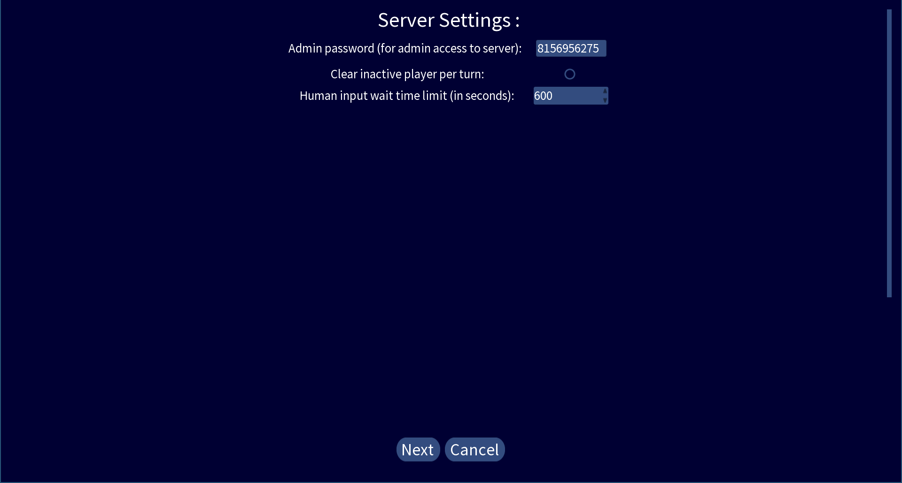
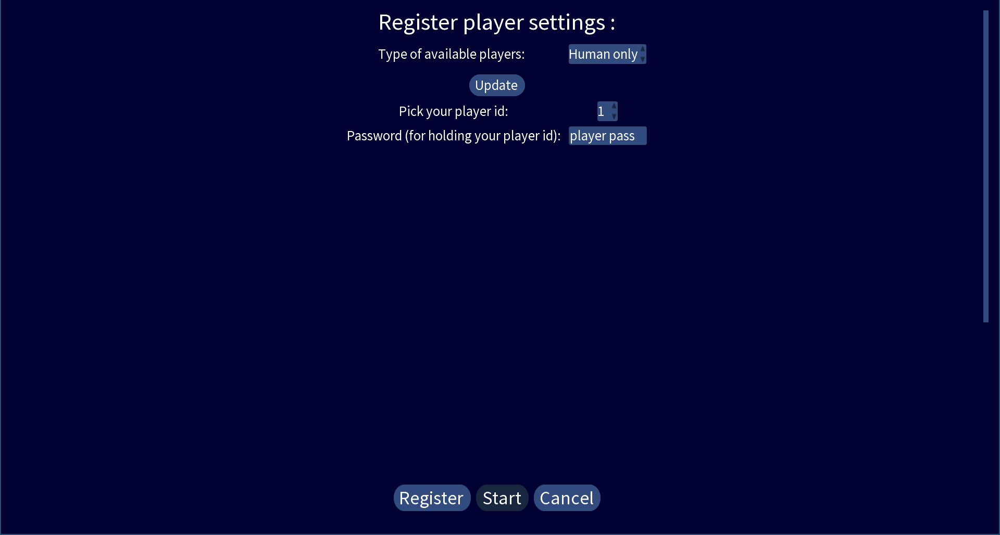

# Quick start guide
1. [Create new game](#create-new-game)
2. [Game UI](#game-ui)

## Create new game

### Main menu
When you first enter the game, you will see the main menu.

To create a new game, click the "New Universe" button.

### Generate New Universe

The default settings will generate a universe and each player has one star initially. 
Here are the settings you should consider to tune:
* Total number of AI + human player: the initial number of player in the universe
* Universe name: use a new name for a new game to prevent overriding your other saved games
* Universe x dimension: the universe has 3 spatial dimension (x, y, z), this determines the maximum of x
* Universe y dimension: determine the maximum of y
* Universe z dimension: determine the maximum of z, it is recommended to set this to a small value since it is harder
to interpret the visualization of a universe with high z dimension in this game

The ideal size of the universe depends on the spec of your PC.
A reasonable suggestion is (x dimension = 10, y dimension = 10, z dimension = 3).

Next, you can click the "Generate" button, it may take a while to generate the universe.

### Server settings

The game creates a server even if it is single-player.
For a single-player game, you may tune:
* Human input wait time limit: the game waits that many seconds a turn for your input,
your can select 10000000000 seconds (at the top of the select box) if you want nearly infinite wait time.

Click "Apply settings" to continue.

### Register player settings

To register yourself as a human player in the server:
1. Choose "Human only" in "Type of available players"
2. Click "Update"
3. A set of id of available players will appear in the "Pci your player id" select box,
you can just leave it as "1"
4. You don't have to change the password for a single-player game
5. Click "Register" to register you as the player
6. If everything goes well, you will see "Registered player id: 1", now you can click "Start" to start the universe

## Game UI

Click "Hello Universe!" to enter the main game UI.

The UI is separated into 4 region:
1. [World map]()
2. [Top bar]()
3. [Player Information]()
4. [Command Information]()

### World map