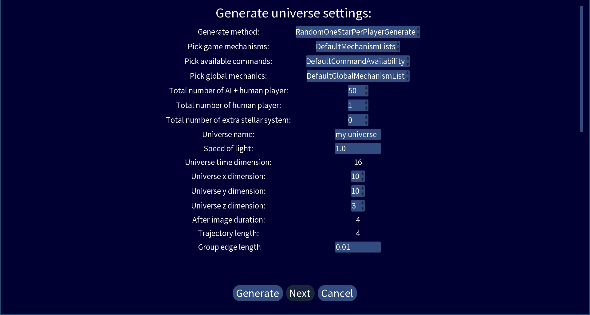
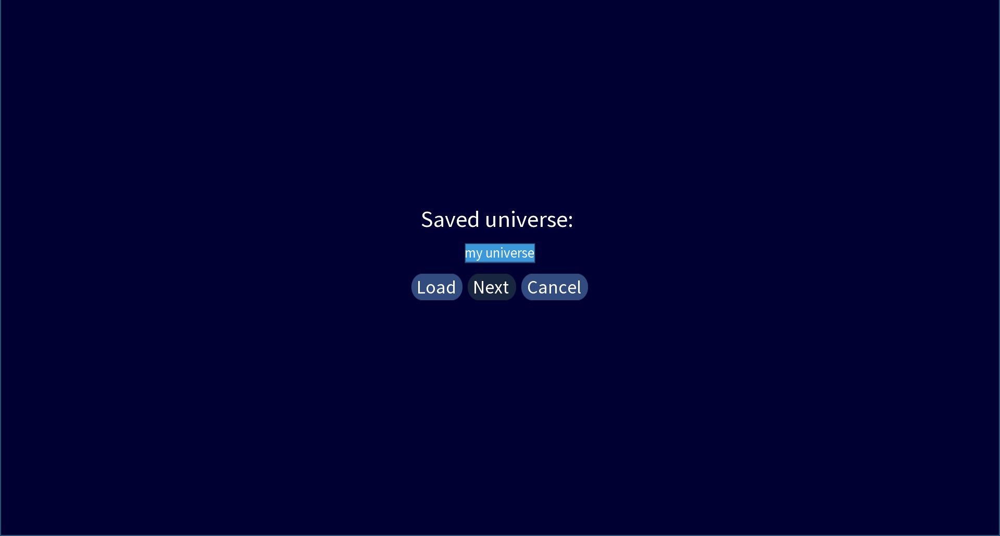
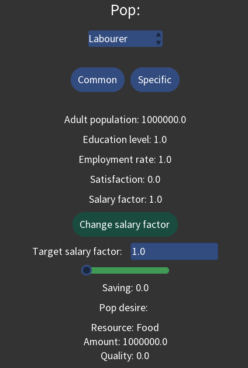
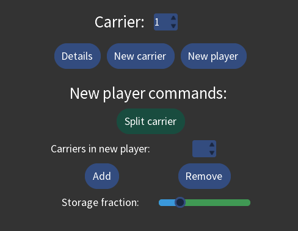
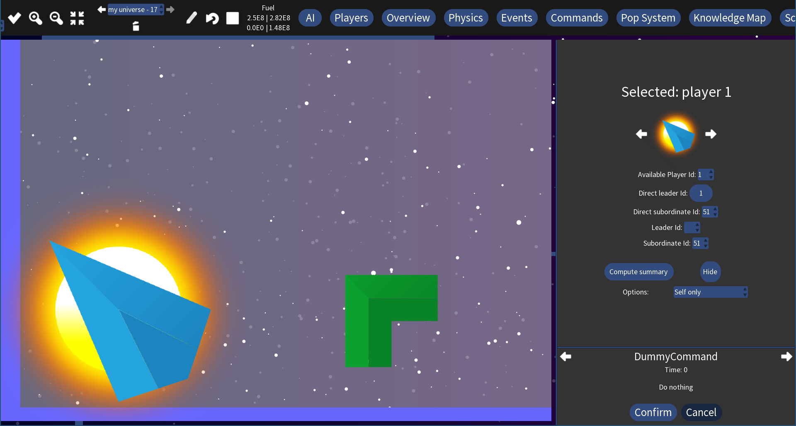

# Quick start guide

1. [Core idea](#core-idea)
2. [Create new game](#create-new-game)
3. [Game UI](#game-ui)
4. [Load saved games](#load-saved-games)
5. [Let AI do everything](#let-ai-do-everything)
6. [Play the game yourself](#play-the-game-yourself)
7. [Things you can do](#things-you-can-do)

## Core idea

Though a computer game can never be fully realistic, a certain degree of realism makes a game more immersive and
interesting. From our current knowledge in physics, our universe is governed by Einstein's theory of relativity.
Particularly, to describe things at the scale of ~100 light years, we need special relativity. Roughly speaking, special
relativity tells us that

* Information travel is bounded by the speed of light
* Time dilation: relative to an observer, the clock of a moving object ticks slower

Having arbitrary faster-than-light technologies, which many other space games do, is forbidden by special relativity.

In contrast, special relativity plays a core role in this turn-based game. As a consequence, you will experience a few
unconventional concepts:

* typically, you observe the past state instead of the current state of other players
* whenever you want to interact with a player, including yourself, you send a command. The command travels at the speed
  of light
* time-dependent mechanisms may not be executed once per turn due to time dilation

Due to the restriction of the speed of information travel, you cannot directly control your whole territory. Instead,
you have a set of direct subordinates, and you can ask them to do things by sending commands. Your direct subordinates
are also players with autonomy, they may have their subordinates. You might also be a subordinate of another player.

The game is turn-based. In a turn, you make your decision to add some commands into your plan, then you send your
commands out, note that commands may take several turns to reach the target. After that, you enter the next turn to get
the new view of the universe, which are mostly the past states of other players due to the distance.

This game aim at giving you a feeling of immersion as if this is how our future will actually look like, given that our
current understanding of physics is not too far off.

## Create new game

### Main menu

When you first enter the game, you will see the main menu.

To create a new game, click the "New Universe" button.

### Generate New Universe

The default settings will generate a universe where each player has one initial star. Here are the settings you should
consider to tune:

* Total number of AI + human player: the initial number of players in the universe
* Universe name: use a new name for a new game to prevent overriding your other saved games
* Universe x dimension: the universe has 3 spatial dimension (x, y, z), this determines the maximum of x
* Universe y dimension: determine the maximum of y
* Universe z dimension: determine the maximum of z, it is recommended to set this to a small number since it is harder
  to interpret the visualization of a universe with large universe z dimension

The ideal size of the universe depends on the specs of your PC. A reasonable suggestion is (x dimension = 10, y
dimension = 10, z dimension = 3), or try (x dimension = 6, y dimension = 6, z dimension = 3) for a smaller map.

Typically, depending on the size of the map, there is a minimum "Universe t dimension" required. Before you reduce the
size of the map, you can pick a small value for "Universe t dimension" (e.g., 1), then changing the spatial dimension
will automatically pick the smallest possible "Universe t dimension" for you.

Next, you can click the "Generate" button, it may take a while to generate the universe.

### Server settings

The game creates a server even if it is single-player. For a single-player game, you may tune:

* Human input wait time limit: the game waits that many seconds a turn for your input, your can select 10000000000
  seconds (at the top of the select box) if you want nearly infinite wait time.

Click "Apply settings" to continue.

### Register player settings

To register yourself as a human player in the server:

1. Choose "Human only" in "Type of available players"
2. Click "Update"
3. A set of id of available players will appear in the "Pick your player id" select box, you can just leave it as "1"
4. You don't have to change the password for a single-player game
5. Click "Register" to register you as the player
6. If everything goes well, you will see "Registered player id: 1", now you can click "Start" to start the universe

## Game UI

The UI is separated into 4 region:

1. [World map](#world-map)
2. [Top bar](#top-bar)
3. [Player Information](#player-information)
4. [Command Information](#command-information)

### World map

World map is where you visualize all the players in the universe.

You can zoom in/out by pressing +/-, if you have a touch screen, you can also use your fingers to zoom.

The universe has 3 spatial dimension. Instead of visualizing the universe by fancy 3D graphics, the 3D universe is
projected into a 2D plane. You can see many white squares in the world map, a white square represent a cube at a
specific integer coordinate.

The x coordinate increases when you move to the right, and the y coordinate increases when you move up. If you follow
the recommendation in this guide where z-dimension = 3, you will see three cubes along the oblique axis, z coordinate
increases when you move upper-right. You can click on the white square to select the cube. you will see a blue box
around the white square, and the coordinates of the selected cube will be displayed on
the [top bar (coordinates)](#coordinates). Because information takes time to travel, you can also see that the time
coordinates of cubes are different. The farther away the cube from your player, the earlier the time it is.

A non-empty cube contains players. Depending on the map mode, whether the player has stellar system or spaceship, and
whether the player is a top-level independent leader, players many look differently on the world map. You can click the
player to select it as the primary selected player, surrounded by green circle. If you already have a primary selected
player, selecting other players create a red circle around the player. You can click the player again to unselect it. To
unselect all players, press "Esc" on your keyboard or use the [command plan buttons](#command-plan-buttons).

### Top bar

Depending on the settings and the screen size of your device, there may be a horizontal scroll bar under the top bar.

#### Coordinates

Display the coordinates of your selected cube. You can also select coordinates here. The "z limit" and the tick button
allow you to limit the number of observable cubes by their z coordinate in the world map, but you don't have to worry
about this if your z dimension = 3.

#### Zoom buttons

From left to right: zoom-in, zoom-out, default-zoom.

Recall that your can use your "+" and "-" keyboard button or your finger to zoom in/out.

#### Universe history

The game keep your past view of the universe for a few turns. If this is not the first turn, you can look back into the
history. The "trash bin" button clear the history prior to what you are viewing.

#### Command plan buttons

From left to right:

* Plan observable mode on/off: recall that your action in the game is done by sending commands your unsent commands are
  stored in plan, turning this on allow you to see how will all the players change after all the commands you sent are
  executed. Note that this may not be what will happen in reality, since commands take time to travel and things may
  have changed after a command arrives the location of the target player
* Clear all commands in plan
* Unselect all players

#### Fuel information

Your stock of fuel is divided into 4 categories:

* Trade (upper-left): for trading with other player
* Production (upper-right): for paying salary and manufacturing
* Movement (lower-left): for moving this player
* Storage (lower-right): not being used, can be transferred to other categories, note that the transfer is irreversible

#### Player information buttons

Control the displayed information in [player information](#player-information). The whole player information pane will
be hidden if you click the button twice.

The rightmost button controls whether the [command information](#command-information)
should be displayed.

#### Server information

Display the status of the server.

The "update to latest" button on the right lights up when a newer view of the universe is available, click the button to
update the view and clear your stored commands in the plan.

#### Server control

Server stop waiting (admin):

* No: always wait for all human input
* After input: only wait for your input
* Always: Don't wait, the AI will compute the input for you

Stop server (admin): completely stop the server from running and stop getting input from human.

#### Upload commands button

Upload all commands from your plan to the server.

#### Settings and help buttons

* Settings button: go to the settings screen
* Help button: go to the help screen, the help screen contains a link to this documentation

### Player information

This is where you see the information of players. You will also create [to-be-confirmed commands](#command-information)
here.

You can choose which information to show by the [player information buttons](#player-information-buttons). The default
is "Overview".

### Command information

Whenever you create a command from [player information](#player-information), the command will appear here. You can see
the name of the command ("DummyCommand"), the universe time when the command is going to send ("Time: 0"), a description
of the command ("Do nothing").

If you want to send this command, click "Confirm" to add the command to your plan. You can view your previous (or next,
if any) confirmed commands by clicking the arrow, and you can "Cancel" your confirmed commands.

## Load saved games

### Auto-save

The game saves the universe right after the universe generation, and auto-save is performed at the beginning of each
turn. You can find the saved files in the `saves` directory where your game is located.

### Quit the game

To quit the game, you can directly close the window, or you can use the "Quit game" button
in [settings](#settings-and-help-buttons).

### Load universe

Open the game, and click "Load Universe" in the [main manu](#main-menu).

You will see a list of saved universe. Select the universe you want to load and click "Load" to enter
the [server settings](#server-settings) screen.

## Let AI do everything

You can completely rely on AI to play this game.

Firstly, open the game and create a new universe.

Click "AI" in your top bar. Select the "DefaultAI", and click "Compute"
to get a list of commands computed by the AI.

You can "Add" or "Remove" a specific computed command, or you can simply click "Use all" to put all the computed
commands into your plan.

Then you can click the [upload button](#upload-commands-button) to upload the commands from your plan to the server. The
server may take a while to complete the computation. When the
[update to latest button](#server-information) light up, click it to enter the next turn.

Once again, you can use the "DefaultAI" to make the decision.

## Play the game yourself

Instead of relying completely on the default AI, you may want to play the game yourself.

Now close the game and start a new universe. You may consider setting the human wait time limit in
[server settings](#server-settings) to a high value, e.g., 10000000000.

### Basic concepts

Let's introduce some basic concepts before going into the game.

#### Pop and carrier

Relativitization is centered around population, similar to many other games, we call it "pop".

Types of pop:

* Labourer: work in factory to produce fuel and resource
* Scholar: conduct basic research
* Engineer: conduct applied research
* Educator: educate pop
* Medic: provide medical environment to improve population growth
* Service worker: trading of resources
* Entertainer: provide entertainment
* Soldier: fight war

"Carrier" is where pops work and reside on. A carrier has every type of pop in it, with a varying number of population.

Types of carrier:

* Stellar system: provide basic fuel supply, huge mass
* Spaceship: can be built by player

One or more carriers form a player, the fundamental playable unit in Relativitization.

#### Fuel and Resource

In a huge world with speed limit imposed by relativity, credit-based currency may not work. Instead of paper money, fuel
is used as the currency in Relativitization. Specifically, fuel is measured in rest mass (kg), and it can be turned into
energy by the famous mass-energy equivalence.

(For people who know some physics: we don't use energy as the currency because energy is not Lorentz invariant. )

Roughly speaking, resources can be divided into 3 categories: primary, secondary, special.

Primary resources:

* Plant
* Animal
* Metal
* Plastic

Secondary resources:

* Food: need animal and plant
* Cloth: need animal and plastic
* Household good: need plant and plastic
* Research equipment: need animal and metal
* Medicine: need plant and metal
* Ammunition: need metal and plastic

Special resources:

* Entertainment: produced by entertainer

All resources have a property called "quality". Primary resources are only needed for producing secondary resource in
factory. Secondary and special resources are needed by pop, but special resources are not produced in factory.

#### Economy

Regardless of whether a player is a leader of a subordinate or others, the economy is local. Each player has a local
stock of fuel and resources, local prices of resources, local demand and supply.

The local stock is divided into 3 categories:

* Trade: allow pop and other players to buy here
* Production: your factories will consume resources here
* Storage: not being used unless transfer to other categories

Since every resource has a "quality" property, to simulate a market where there are multiple options of a type of
product, each resource is divided into 3 classes in the local stock with decreasing qualities:
first, second, and third.

Each class of resources has a price, the prices are affected by the ratio between the demand and the resources available
in the "trade" stock.

Demand:

* Pop daily need
* Pop salary
* Factory consumption
* Institute and laboratory research need

Supply:

* Factory production
* Stellar system has a base fuel production
* Entertainer produces entertainment resource

Local economies are not completely isolated, a player can send fuel and resources to other players, buy resources from
other players, and build factories to manufacture in the carriers of other players.

### A brief overview of your status

#### Find yourself in the world map

Now back to the game.

Zoom in by your "+" key, your finger, or [zoom buttons](#zoom-buttons).

If you are not showing the "Overview" in [player information](#game-ui), click "Overview"
in [player information buttons](#player-information-buttons).

Then click your player icon under the "Overview: player 1", the world map should scroll to center at the position of
your player.

#### Your hierarchy and summary

Click "Players" in [player information buttons](#player-information-buttons).

You have no subordinate, and you are your own direct leader.

Click "Compute summary".

It shows some basic statistics of your player, including population, the satisfaction of your population, military
information, supply and demand of fuel and resources. As of now, you don't need any plant. If you select "Food" instead
of "Plant", you will see you need a lot of food, but you don't produce any.

#### Carrier and pop

To take a closer look on what is happening in your carrier, click "Pop system"
in [player information buttons](#player-information-buttons).

You only have a carrier "0". It is a stellar system. It has a huge mass (~ 1E30 kg) and a big ideal population. The
"Max. movement fuel delta" corresponds to how much fuel the carrier can use per turn to move this player. Typically, it
is impractical to move a player with a stellar system.

"Common pop data" is the common property of a pop regardless of the pop type. The labourer pop in this carrier has
1000000 population, 1.0 education level, 0 unemployment rate, 0 satisfaction, and 1E-6 salary.

Satisfaction affects population growth and other functionalities of pop. To increase satisfaction of a pop, the desire
of the pop has to be fulfilled. Pop will buy their desire resources automatically. As a player, you need to have
sufficient resource, and ensure that you pay the pop well, so they have sufficient fuel to buy the desired resource.

### Adjust salary

You can adjust the salary of a pop manually, or use "DefaultSalaryAI" to adjust salaries of all pop.

#### Option 1: manual

You can type in the "Target salary" text field to change your target. Alternatively, you can use the slider and the "-"
, "+" buttons below. The slider change the coefficient of the number in scientific notation, the "-" button reduces the
number by 10 times, and the "+" button increases the number by 10 times.

Once you are done, click "Change salary" and click "Confirm" in the [command information](#command-information). You may
select other pop type under "Pop:" to change their salary as well.

#### Option 2: DefaultSalaryAI

Adjusting salary every turn can be tedious if you have many carriers, so the game provide a "DefaultSalaryAI" to
automate this.

Similar to how you use the [default AI](#let-ai-do-everything), click "AI" in the
[player information buttons](#player-information-buttons), select "DefaultSalaryAI" instead of "DefaultAI", click "
Compute" and "Use all" to put all the commands into your plan.

Note that "Use all" will remove the commands in your plan and add the ones computed by the AI. Do this at the beginning
of your turn.

### Factories

Resources are manufactured by factories. You can click the "Common" button to hide the common pop data, and you will
find the "Build factory commands" section.

You can try to click the "Build resource factory button". However, as you can see in
[fuel information in top bar](#fuel-information), you have zero production fuel.

And you will see this in the [command information](#command-information). It tells you that this command cannot be sent,
with the reason "Not enough fuel rest mass".

To fix the problem, you need to transfer your fuel from storage to production. Typically, the game will manage the fuel
distribution for you based on your preset proportion, but the fuel is all located at the "storage" category in your
first turn to allow you to distribute the fuel yourself.

To enforce a redistribution of fuel, you have to send fuel to yourself.

#### Send fuel

Click "Economy" in [player information buttons](#player-information-buttons).

It shows your current fuel and your default fuel proportion. Slide the slider under "Send fuel to this player" to max
(right), then click "Send fuel to this player" and click "Confirm" in the [command information](#command-information).
You will see your "production" fuel is now 5.0E8.

#### Resource factories

Now go back to "Pop System". Click "Build resource factory" and "Confirm". You should now see a plant factory under "
Factories:".

It will hire labourer and consume production fuel to produce "Plant" automatically.

Now repeat the same step for every resource, you can choose the resource of the factory in "Output resource:"
under "Build resource factory".

After you have created a secondary resource factory, such as a "Food" factory, you can see the factory needs to input
some primary resources to produce the secondary resource.

#### Fuel factory

Although you have a base production of fuel from your stellar system, it is always good to have more. Let's build a fuel
factory. Click "Build fuel factory" and "Confirm". You should be able to see the information of the fuel factory under
"Factories".

### Research

Similar to [economy](#economy), knowledge in Relativitization is also local to each player. To view the information,
click "Science" in the [player information buttons](#player-information-buttons).

.

* Common sense: the common knowledge shared by all players
* Player knowledge: the knowledge level of this player
* Science application: the practical impact of the player knowledge

The knowledge is divided to basic knowledge and applied knowledge. Basic research is conducted by "scholar" at "
institute". Applied research is conducted by "engineer" at "laboratory".

Go back to "Pop System" and select "Scholar" under "Pop:". You wil see "Build institute commands".

The "New institute knowledge x" and "New institute knowledge y" correspond to the position in
[knowledge map](#knowledge-map).

#### Knowledge map

Click "Knowledge Map" in [player information buttons](#player-information-buttons).

#### Knowledge map control buttons

From left to right:

* Zoom in the whole knowledge map
* Zoom out the whole knowledge map
* Increase the icon size in the knowledge map
* Decrease the icon size in knowledge map

#### Project map

Because of randomness, your project map should look different from this

Icons on the knowledge map:

* Opaque book: done basic project
* Transparent book: known basic project
* Opaque wrench: done applied project
* Transparent wrench: known applied project
* Arrow: project dependency

You can click on a book or wrench to see the detail on the right of
the [knowledge map control buttons](#knowledge-map-control-buttons).

#### Institute

Click on a transparent book. Then go back to "Pop System"
You can see that the "New institute knowledge x" and "New institute knowledge y" have changed. Click "Build institute"
and "Confirm". Come back to "Knowledge Map" again, and check "Show institute/laboratory" under
the [knowledge map control buttons](#knowledge-map-control-buttons).

The institute should be located on top of the position you selected. If you decrease the icon size, you can see a small
circle around the institute. It is the range where the institute will be responsible to research.

#### Laboratory

Now do the same thing for laboratory.

Click on a transparent wrench. Go to "Pop System". Select "Engineer" under "Pop:", this time increase the "New
laboratory knowledge range" to 2.5 (just click the "+"). Click "Build laboratory" and "Confirm". You should see a
laboratory with a much bigger white circle.

#### Build more institutes and laboratories

A larger range institute/laboratory cover a larger research space, but the average strength is lower.

Build more institute and laboratory wherever you like. 5+ institutes and 5+ laboratories with the default
"Max. employee" avoid scholar and engineer to be unemployed. In the future, when you started to produce "Research
equipment", you can also increase the "Max. equipment consumption"
to speed up your research.

### New carrier

You still have some production fuel left. Let's create a new carrier.

Click "Pop System", then click "New carrier" below the carrier number.

Click "Build carrier" and "Confirm". If you click the "Carrier:" select box, you will now see "0" and "1". Carrier 1 is
the carrier you just built, you can click "Carrier" to display the information of carrier 1. The "Carrier type" of
carrier 1 should be "SPACESHIP".

Similarly to what you did with your carrier 0, build some factories, institutes and laboratories on carrier 1. You may
want to increase the "New factory max. employee" for factories and "Max. employee" for institutes and laboratories since
the default value is quite small as you don't have much population at your new carrier.

### Next turn

Before going to next turn, you may click "Commands" in [player information buttons](#player-information-buttons)
to review the commands you have created.

Remember that things you have done (e.g., built factories, new carrier, etc.) happened in your plan, you have to upload
the commands from your plan to the universe in the server. Click
[upload commands button](#upload-commands-button) to upload your commands, the button will turn green when the upload
has succeeded. You should see the [update to latest button](#server-information) lights up, click it to get the data for
the next turn.

### Player icon

Because you now have at least a spaceship, your player has a different player icon.

The player icon changes due to whether you have a stellar system, whether you have a spaceship, and whether you are a
top leader.

### Adjust salary for the new carrier.

You may want to [adjust your salary](#adjust-salary) again.

### Create new player by splitting carriers

Because a cube in the universe can only generate a limited amount of fuel, you may want to expand to other cubes, or
even fight with other players. Remember that you have a stellar system, which is impractical to move. If you want to
expand to other cubes, you have to create a new player and gift your spaceship (carrier 1) to the new player. The new
player will be your direct subordinate, and you can ask your subordinate to move to other places.

Click "Pop System", then click "New player" under the carrier number.

Select "1" under "Carrier:", and click "Add". Be careful not to add carrier 0, it will gift your main stellar system to
the new player. Then click "Split carrier" and "Confirm". It will create a new player as your direct subordinate in the
next turn. You can tune the initial fuel and resources of the new player as a "Storage fraction" of your storage.

Go to [next turn](#next-turn) to see your new subordinate.

### Subordinate in world map

Click "Players" in [player information buttons](#player-information-buttons) . [Zoom in](#zoom-buttons) the world map
and click your player icon in "
Players" to center the world map at the position of your player.

You will see a new player right next to your own player. Your icon changes back to the initial icon since you now have
no spaceship.

In the player information, player 51 is now shown as your subordinate.

You and your subordinates are in different colors, because your subordinate is fundamentally an independent player,
though it has certain restrictions being a subordinate.

To display all player under the same top leader as the same color. Click "Map Mode"
in [player information buttons](#player-information-buttons). Then select "Top leader" in "Map color mode".

### Income tax

One of the advantage of being a leader of other players is that the leader can get a fraction of tax collected by
subordinates.

Click "Economy" in [player information buttons](#player-information-buttons), then click "Tax info", scroll down to
"Income tax".

Income tax is paid when pop receives salary. Depending on whether the salary is lower than or higher than
"low-middle boundary" and "middle-high boundary", the pop pays "low income tax", "middle income tax", or "high income
tax". Having a high income tax allows you to have more fuel as the leader, but it prohibits the growth of your
subordinates. Furthermore, sending collected tax from subordinate to leader subject to a logistic loss depending on the
technology and the distance between the players.

Decide your income tax and the boundary, create the commands and "Confirm".

### Select your subordinate as primary selected player

Ensure that you have unselected all players. You can use the [Clear all selected player button](#command-plan-buttons),
or press the "Esc" key on your keyboard, or manual click all the players on the world map with
[green/red circles](#world-map). Then select your subordinate as the primary player, you can do so by clicking the icon
on the [world map](#world-map), or you can select it in the "Direct subordinate id:" select box in
["Players" information](#your-hierarchy-and-summary).

### Options to move your subordinate

The most important interaction between you and your subordinate is to ask your subordinate to move to some other places.

Click "Physics" in [player information buttons](#player-information-buttons). There is a bunch of physics-related
information, scroll down to see "Movement commands:"

There are two major ways to ask your subordinate to move:

* Ask the player to change to a specific velocity.
* Ask the player to move to a specific location.

Select one of the other players/cubes on the world map, you will see the target coordinates change to the selected
location, and the target velocity points to the location with a magnitude equals to "Max speed:".

After a player received "Change velocity" command, if the player cannot change to the target velocity, due to a
limitation of fuel or a limitation of power, it will try to change to the closet velocity at that direction. If that is
not possible, it will decelerate.

Since "Change velocity" is a one-off command, tt would be quite difficult to control the target by "Change velocity"
given the time delay. Typically, "Move to location" is simpler to use.

#### Execute warning

Select one of the other players/cubes on the world map. Click "Move to location" and "Confirm". A strange
"ExecuteWarningCommand" will appear on [command information](#command-information).

Here is the reason. Recall that you essentially add a command into your plan here, and the command is executed on the
target player in your plan, the execution fails, and the warning is shown. If you ignore the warning, your command will
still be sent after you upload all your commands to the game universe. The command will take some turns to reach the
target, things may happen during the time and your command may still get executed in the future.

However, it is not recommended ignoring the warning unless you know what you are doing.

#### Movement to location command

The warning tells you that your subordinate does not have enough fuel. You can either:

* Send fuel to your subordinate, you select your subordinate as the primary selected player and
  [send fuel to the player](#send-fuel).
* The default "Max. speed" is 0.5, you can decrease it, a lower "Max. speed" movement requires less fuel

Probably you should reserve your fuel for something else, let's reduce the "Max. speed" to ~0.1, click
"Move to location" and "Confirm".

Instead of a regular command, this command add a "MoveToDouble3DEvent" to your subordinate, as you can see in
[command information](#command-information).

#### Event

An event of a player has one or more options, stays on a player for a certain number of turns, and generate commands
based on the selected option or a default option if none is selected.

Select your subordinate, and click "Events" in the [player information buttons](#player-information-buttons).

It displays the event name, the maximum stay time of the event, the counter of current stay time, a description of the
event, the choices of the event, and the selected choice ("default" means unselected).

The "default" choice means differently for different events, and it may depend on the situation of the player. In the
case of "MoveToDouble3DEvent", the player will move to the location unless there are other movement events.

A "MoveToDouble3DEvent" will compute the appropriate "Change velocity" command to the player until the player reaches
the location. The negative of this event is that it prevents fuel production and disable receiving fuel from other
player, because increasing the fuel means the rest mass of the player also increases, making it impossible to compute
the appropriate velocity to change to.

Your subordinate (not you) can select choice "0" to keep the event or choice "1" to cancel it, there is nothing you can
do to about it directly (it may be helpful to increase the relation with the player though).

Wait for a few turns, you will see your subordinate moving to the location you asked the player to.

#### Time dilation

Recall that [time is dilated when velocity is not zero](#core-idea), when your subordinate start moving, select your
subordinate and click "Physics".

"Gamma" is the relativistic factor, and "Gamma inverse" is the dilated time experienced by the player. It is less than
1.0, which means the time experienced by the player is less the time experienced by a stationary player (more precisely,
stationary relative to the inertial frame where the computation is done).

The dilated time is added into the "dilated time residue", if it is greater than one, then things happen normally, else
the time dilation effect prevents some mechanisms from happening. The "Is next dilation action turn: false" indicates
that time-dilated mechanisms will not happen in the next turn for that player.

## Things you can do

Now you should understand the basic of the game. You should be able to build up your population, your research, your
carriers, and your subordinates.

You can explore how the politics, economy, and diplomacy works, declare war on other players, move your subordinate to
cubes where your enemies are located at to fight, prepare for rebellions... As long as you do not gift away your stellar
system, your player will not die. The worst thing that can happen to you is that you may lose a war or choose to
surrender in a war to become someone's subordinate, but you can always find a chance to declare independence to your
direct leader or top leader to get back your freedom.

Or if you are impatient, you can choose "Always" in [Server stop waiting (admin):](#server-control)
to get the universe going automatically. Simply [update the universe](#server-information) and enjoy watching the
societal evolution. Turn [Server stop waiting (admin):](#server-control) to "No" if you want to control the player
again.

### Contributing!

It is not an easy task to design interesting mechanics in such an unconventional game. Feel free to open an issue to
make your suggestion.

The source code of the game is quite modular, so it should be relatively easy to implement your alternative mechanics.
Consider creating pull request to the project, and let's think about the best way to support modding in this game!